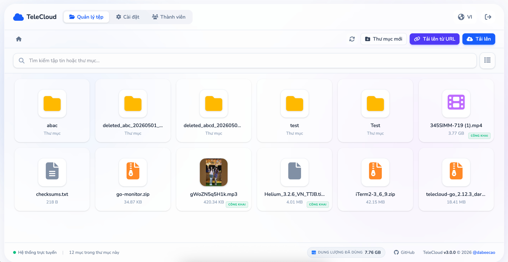
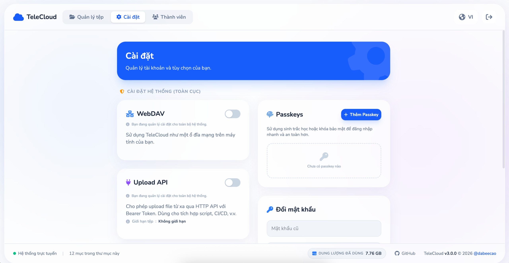
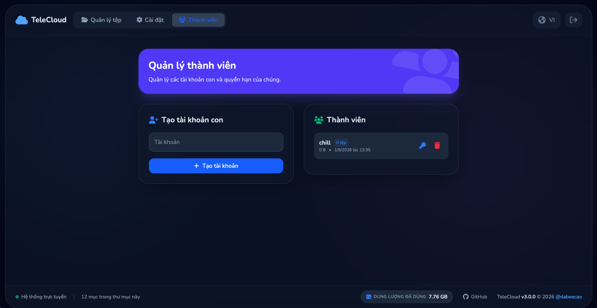
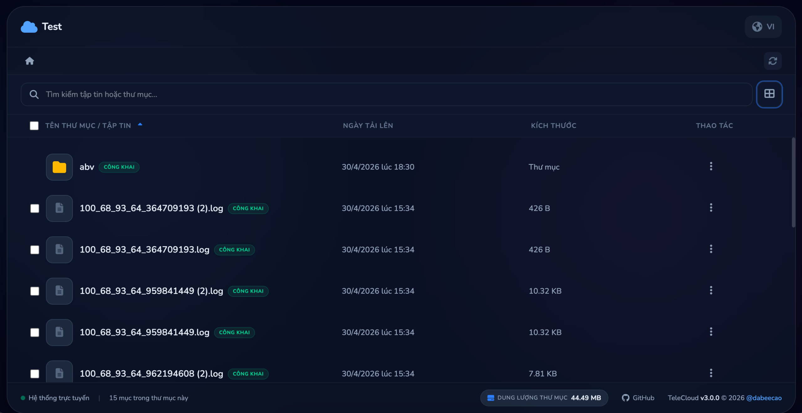
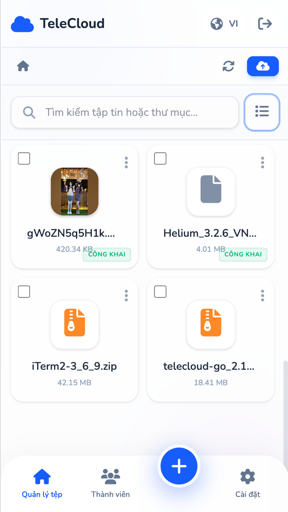
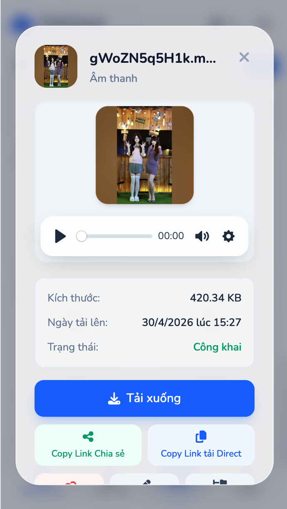
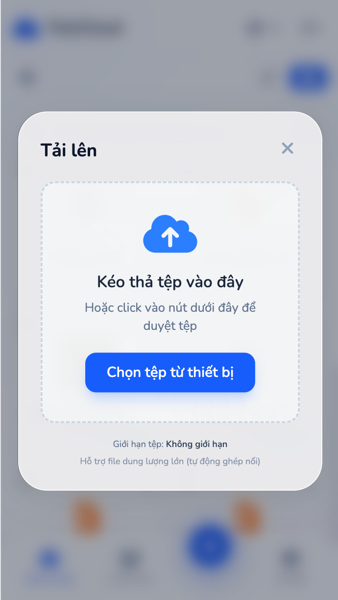
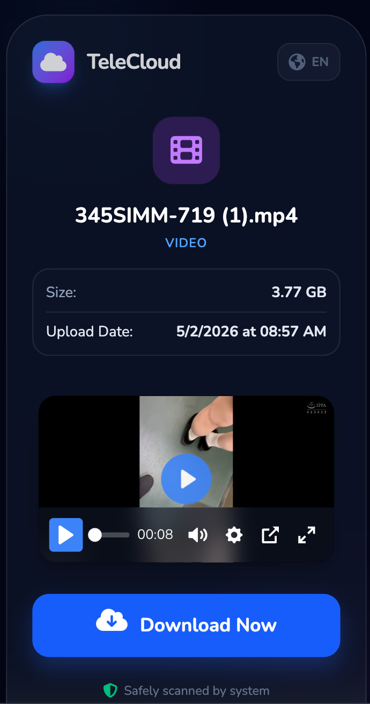
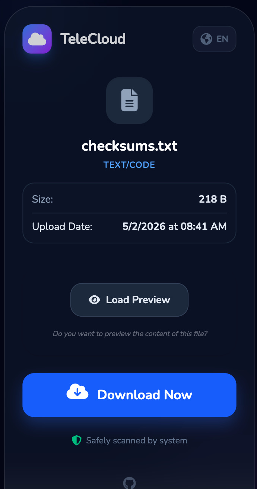

# TeleCloud 

<div align="center">

[🇻🇳 Tiếng Việt](./readme.md) | 🇺🇸 English
**[📢 Beta Test Group](https://t.me/+p-d0qfGRbX4wNzJl)**
*Join the group to test new features and report bugs*
</div>

**TeleCloud** is a project that allows you to use Telegram’s nearly unlimited storage capacity to store and manage files.

This project has been **completely rewritten in Golang** from the original project [dabeecao/tele-cloud](https://github.com/dabeecao/tele-cloud), delivering excellent performance, extremely low memory usage, and the ability to compile into a single executable (binary) that can run anywhere without requiring a development environment.

---

## 📸 Preview

### 🖥️ Desktop Interface
| | |
| :---: | :---: |
|  |  |
|  |  |

### 📱 Mobile Interface
| | | | | |
| :---: | :---: | :---: | :---: | :---: |
|  |  |  |  |  |

> *The interface is optimized for all devices (Responsive Design)*

---

## ✨ Features

* 📁 Store files directly on Telegram with **unlimited file size** (Automatically splits large files into 2GB/4GB parts).
* 🎬 Stream videos and music directly in the web interface and shared links (Seamless streaming of split files).
* 🔗 Share links with options for normal links, direct download links, and **Folder Sharing**.
* 🗂️ Intuitive file management interface (File Browser) with **Grid** and **List** view modes.
* ⬆️ High-speed parallel uploads (multi-threading)
* 📦 Chunked uploads for better speed and stability
* 📂 **WebDAV** Support: Mount TeleCloud as a network drive on your computer (Windows, macOS, Linux).
* 🔌 **Upload API**: Allows remote file uploads via HTTP API (Bearer Token) for integration into scripts or CI/CD.
* 📥 **URL Download**: Supports downloading files directly from a URL to your storage.
* 🎥 **Media Downloader**: Supports downloading Videos and Music from various platforms (YouTube, TikTok, Facebook...) using **yt-dlp** directly in the UI.
* ⚡ **Background Download**: Supports background URL downloads with real-time progress notifications, no browser session required.
* 👥 **Multi-user Management**: Support creating child accounts with isolated storage spaces (Virtual Path).
* 🤖 **Multi-Bot (Bot Pool)**: Supports using secondary bots to increase upload/download throughput and avoid Telegram rate limits (FloodWait).
* 🔐 **Passkey**: Supports secure login using biometrics (TouchID/FaceID) or security keys (WebAuthn).
* 🌐 **Multi-language**: Supports Vietnamese and English UI

---

> [!NOTE]
> **From version 2.12.0 onwards**, TeleCloud implements automatic Cache Busting for static assets. You no longer need to "Purge Cache" on Cloudflare or your browser after every update.

---


## 🛠️ Automatic Installation

### Automatic Installation on Windows

Easily install and manage TeleCloud on Windows using the automated script:

1. Download the [**`auto-install-en.bat`**](https://raw.githubusercontent.com/dabeecao/telecloud-go/main/auto-install-en.bat) file to your desired installation folder.
2. Right-click and select **Run as Administrator**.
3. Use the Menu to:
    * Automatically install FFmpeg & Cloudflared.
    * Download the latest TeleCloud release from GitHub.
    * Simple Cloudflare Tunnel (custom domain) setup.
    * Start/Stop application in the background and view logs.

### Automatic Installation on Linux / Termux / macOS / Raspberry Pi

This is the simplest and most automated way to install, configure, and manage TeleCloud. The script supports multiple environments such as Ubuntu, Debian, CentOS, Arch, macOS (Homebrew), Termux, and ARM architectures (Raspberry Pi).

The script automatically installs dependencies (FFmpeg, Tmux, Cloudflared...), configures the service, and provides a convenient management menu via the `telecloud` command.

**Usage (Universal Command):**
```bash
# Using curl (Recommended)
curl -fsSL https://raw.githubusercontent.com/dabeecao/telecloud-go/main/auto-setup-en.sh -o auto-setup-en.sh && bash auto-setup-en.sh
```

```bash
# Or using wget
wget -qO auto-setup-en.sh https://raw.githubusercontent.com/dabeecao/telecloud-go/main/auto-setup-en.sh && bash auto-setup-en.sh
```
Or if you have already cloned the repository:
```bash
chmod +x auto-setup-en.sh
./auto-setup-en.sh
```

#### ⚠️ Note for Termux Users

For Termux, you should download Termux from one of the following sources:

- [GitHub Releases (recommended)](https://github.com/termux/termux-app/releases)
- [F-Droid](https://f-droid.org/packages/com.termux/)

---

## 🚀 Quick Installation Guide (Using Prebuilt Binary)

This is the fastest way to run TeleCloud without installing a development environment.

### 1. System Requirements

You need to install **FFmpeg** and **yt-dlp** for the system to generate thumbnails and download media from URLs.

* **Ubuntu/Debian:** `sudo apt install ffmpeg python3` and download yt-dlp binary.
* **Redhat-based:** `sudo yum install ffmpeg python3` via [RPM Fusion](https://rpmfusion.org/)
* **Alpine Linux:** `apk add ffmpeg python3 yt-dlp`
* **Windows:** Download a prebuilt version from [ffmpeg.org](https://ffmpeg.org/download.html) and [yt-dlp](https://github.com/yt-dlp/yt-dlp/releases) and add them to PATH.

If FFmpeg or yt-dlp are not installed, the project will still run, but thumbnail generation and URL media downloading will not work.

---

### 2. Download TeleCloud

Go to the [**Releases**](https://github.com/dabeecao/telecloud-go/releases) section and download the appropriate version for your OS (Linux, Windows, or macOS).

---

### 3. Environment Configuration

In the directory containing the binary file, you will find a file named `env.example`. Copy it to `.env` and fill in your information:

```bash
cp env.example .env
```

Main fields in `.env`:

* `API_ID` & `API_HASH`: Get from [https://my.telegram.org](https://my.telegram.org)
* `LOG_GROUP_ID`: ID of the group/channel storing files or use `me` for Saved Messages
* `PORT`: Port to run the application
* `TG_UPLOAD_THREADS`: (Optional) Number of concurrent upload threads per file part. Default is `2`. Increase to `4` for maximum speed.
* `BOT_TOKENS`: (Optional) A comma-separated list of secondary Bot tokens (e.g. `token1,token2`). These bots will help share the workload with your main account, significantly increasing download/upload performance.
  * **Note**: Bots must be added to the storage group/channel (`LOG_GROUP_ID`) and granted permission to send messages. If `LOG_GROUP_ID=me` (Saved Messages), the Multi-bot feature will be automatically disabled because bots do not have access to the user's private messages.
* `DATABASE_PATH`: (Optional) Path to the database file (default: `database.db`)
* `THUMBS_DIR`: (Optional) Directory for storing thumbnails (default: `./static/thumbs`)
* `TEMP_DIR`: (Optional) Path to the temporary directory for storing file chunks during the upload process.
* `PROXY_URL`: (Optional) Proxy to connect MTProto, supports HTTP and SOCKS5 (e.g. `socks5://127.0.0.1:1080`)
* `FFMPEG_PATH`: (Optional) Path to FFmpeg (default: `ffmpeg`). Set to "disabled" to skip video/audio thumbnails if FFmpeg is not installed or causing crashes.
* `YTDLP_PATH`: (Optional) Path to yt-dlp (default: `yt-dlp`). Set to "disabled" to skip URL media downloading if yt-dlp is not installed.

* **Note on Themes**: The application supports multiple UI themes (Neon, Cyberpunk, Lavender, Forest) and a System theme mode. These are configured directly in the Web UI Settings after logging in, and do not require any environment variables.

---

#### 🔑 Get API_ID and API_HASH

* Visit: [https://my.telegram.org](https://my.telegram.org)
* Log in with your Telegram phone number
* Select **API development tools**
* Create a new app
* Retrieve:

  * `API_ID`
  * `API_HASH`

---

#### 📡 Get LOG_GROUP_ID

* Create a Telegram group and add your Userbot (or just create a private group with yourself)
* Make sure chat history is enabled in group settings
* Add bot [@get_all_tetegram_id_bot](https://t.me/get_all_telegram_id_bot) to the group and run `/getid`

Example response:

```
🔹 CURRENT SESSION / PHIÊN HIỆN TẠI

• User ID / ID Người dùng: 36xxxxxxxx
• Chat ID / ID Trò chuyện: -100xxxxxxxxxx
• Message ID / ID Tin nhắn: x
• Chat Type / Loại hội thoại: supergroup
```

Use the **Chat ID** as your `LOG_GROUP_ID`, typically in this format:

```
-100xxxxxxxxxx
```

---

### 4. Login & Run

Open terminal in the binary directory:

**Step A: Authenticate (first time only)**

```bash
# Linux/macOS
./telecloud -auth

# Windows
telecloud.exe -auth
```

Enter your phone number, OTP, and 2FA password (if any).

---

**Step B: Start the server**

```bash
./telecloud
```

Access the web interface at: `http://localhost:8091`
- **On first access**, the system will prompt you to create an admin account and password.
- Other configurations like changing password and configuring **WebDAV** can be done directly in the **Settings** section of the web interface after logging in.
WebDAV at: `http://localhost:8091/webdav`

---

## 🌐 Reverse Proxy Configuration (Nginx)

If you want to use Nginx as a Reverse Proxy (for custom domains, HTTPS), use the following optimized configuration to support large file uploads and streaming:

```nginx
server {
    listen 80;
    server_name your.domain.com;

    # IMPORTANT: Allow unlimited upload size
    client_max_body_size 0;

    location / {
        proxy_pass http://127.0.0.1:8091;

        proxy_set_header Host $host;
        proxy_set_header X-Real-IP $remote_addr;
        proxy_set_header X-Forwarded-For $proxy_add_x_forwarded_for;
        proxy_set_header X-Forwarded-Proto $scheme;

        # Support Range requests for streaming (seeking)
        proxy_set_header Range $http_range;
        proxy_set_header If-Range $http_if_range;

        # Prevent Connection errors when proxying
        proxy_set_header Connection "";

        # IMPORTANT: Disable buffering for large uploads and smooth streaming
        proxy_request_buffering off;
        proxy_buffering off;

        # Increase timeouts to avoid disconnection when processing large files or long streams
        proxy_read_timeout 3600s;
        proxy_connect_timeout 3600s;
        proxy_send_timeout 3600s;
        send_timeout 3600s;
    }

    # WebSocket support for real-time progress notifications
    location /api/ws {
        proxy_pass http://127.0.0.1:8091/api/ws;

        proxy_http_version 1.1;
        proxy_set_header Upgrade $http_upgrade;
        proxy_set_header Connection "upgrade";

        proxy_set_header Host $host;
        proxy_read_timeout 3600s;
    }
}
```

---

## 🔌 Upload API

TeleCloud provides a simple HTTP API so you can upload files from external scripts or the command line.

- **Endpoint**: `POST /api/upload-api/upload`
- **Authentication**: Bearer Token (Get it in the Web UI Settings).
- **Parameters**: `file` (multipart/form-data), `path` (optional), `share` (optional, set to "public" to get a share link immediately).

You can view detailed documentation and `curl` examples directly in the **Settings -> Upload API** section of the web interface.

---

## 🐳 Docker Deployment (Recommended for Servers)

This is the recommended deployment method for servers. It makes it easy to manage, update, and run TeleCloud without worrying about the host OS environment.

### 🎬 FFmpeg and yt-dlp Built-in

The Docker image uses Alpine Linux and **includes FFmpeg and yt-dlp built-in**.
You **do not** need to install or mount any external binaries. Thumbnail generation and URL media downloads work out of the box!

---

### Method 1: Single Container (Quick Start)

The fastest way to get running with just Docker — no Compose needed.

#### Requirements
- [Docker](https://docs.docker.com/engine/install/) installed

#### Steps

1. Pull the image:
```bash
docker pull ghcr.io/dabeecao/telecloud-go
```

2. Configure `.env`:
```bash
mkdir telecloud && cd telecloud
curl -O https://raw.githubusercontent.com/dabeecao/telecloud-go/main/env.example
mv env.example .env
# Edit .env and fill in API_ID, API_HASH, LOG_GROUP_ID
```

3. Authenticate (first time only):
```bash
mkdir -p data
sudo chmod 777 data
sudo docker run --rm -it \
    -v "$(pwd)/data:/app/data" \
    --env-file .env \
    -e DATABASE_PATH=/app/data/database.db \
    -e SESSION_FILE=/app/data/session.json \
    --user 65532:65532 \
    ghcr.io/dabeecao/telecloud-go -auth
```

4. Run:
```bash
sudo docker run -d \
    --name telecloud \
    --restart unless-stopped \
    -p 8091:8091 \
    -v "$(pwd)/data:/app/data" \
    --env-file .env \
    -e DATABASE_PATH=/app/data/database.db \
    -e THUMBS_DIR=/app/data/thumbs \
    -e TEMP_DIR=/app/data/temp \
    -e SESSION_FILE=/app/data/session.json \
    --user 65532:65532 \
    ghcr.io/dabeecao/telecloud-go
```

Access the web interface at: `http://localhost:8091`

**On first visit**, the system will prompt you to create an admin account and password.

> 📁 All persistent data is stored in the `./data/` directory on your host machine.

---

### Method 2: Docker Compose (Recommended)

#### Requirements
- [Docker](https://docs.docker.com/engine/install/) and [Docker Compose](https://docs.docker.com/compose/install/) installed

#### 1. Download configuration files

```bash
mkdir telecloud && cd telecloud
curl -O https://raw.githubusercontent.com/dabeecao/telecloud-go/main/docker-compose.yml
curl -O https://raw.githubusercontent.com/dabeecao/telecloud-go/main/env.example
mv env.example .env
```

*(Or clone the full project if you prefer: `git clone https://github.com/dabeecao/telecloud-go.git`)*

#### 2. Configure environment

Open `.env` and fill in the required fields:

```env
API_ID=your_api_id
API_HASH=your_api_hash
LOG_GROUP_ID=me
PORT=8091
```

> The `DATABASE_PATH`, `THUMBS_DIR`, and `TEMP_DIR` variables are automatically overridden by docker-compose to point inside the `./data/` volume — you **do not need** to set them when using Docker.

#### 3. Authenticate your Telegram account (First time only)

```bash
sudo docker compose run --rm -it telecloud -auth
```

Enter your phone number, OTP, and 2FA password (if any). The `session.json` file will be saved in `./data/`.

#### 4. Start the server

```bash
sudo docker compose up -d
```

Access the web interface at: `http://localhost:8091`

**On first visit**, the system will prompt you to create an admin account and password.

#### Useful commands

```bash
# View logs
sudo docker compose logs -f

# Stop the application
sudo docker compose stop

# Update to a new version
sudo docker compose pull
sudo docker compose up -d

# Remove the container (data in ./data/ is preserved)
sudo docker compose down
```

> 📁 All persistent data (database, thumbnails, temp files) is stored in the `./data/` directory on your host machine.


---

## 🛠️ Build from Source (For Developers)

### Method 1: Build with Docker (Recommended)

The easiest way to build from source — no need to install Go, Node.js, or Tailwind CLI locally. Docker handles the entire build pipeline.

#### Requirements
- [Docker](https://docs.docker.com/engine/install/) installed

#### Steps

1. Clone the project:
```bash
git clone --recursive https://github.com/dabeecao/telecloud-go.git
cd telecloud-go
```
*If you already cloned without `--recursive`, run: `git submodule update --init --recursive`*

2. Build the Docker image from source:
```bash
sudo docker build -t telecloud:local .
```

3. Configure `.env`:
```bash
cp env.example .env
# Edit .env and fill in API_ID, API_HASH, LOG_GROUP_ID
```

4. Authenticate (first time only):
```bash
mkdir -p data
sudo chmod 777 data
sudo docker run --rm -it \
    -v "$(pwd)/data:/app/data" \
    --env-file .env \
    -e DATABASE_PATH=/app/data/database.db \
    -e SESSION_FILE=/app/data/session.json \
    --user 65532:65532 \
    telecloud:local -auth
```

5. Run your locally built image:
```bash
sudo docker run -d \
    --name telecloud \
    --restart unless-stopped \
    -p 8091:8091 \
    -v "$(pwd)/data:/app/data" \
    --env-file .env \
    -e DATABASE_PATH=/app/data/database.db \
    -e THUMBS_DIR=/app/data/thumbs \
    -e TEMP_DIR=/app/data/temp \
    -e SESSION_FILE=/app/data/session.json \
    --user 65532:65532 \
    telecloud:local
```

Access the web interface at: `http://localhost:8091`

> You can also use `docker-compose.yml` — just change the `image:` line to `image: telecloud:local` (or add `build: .`) instead of pulling from the registry.

---

### Method 2: Build Manually (Native)

1. Install **Golang (1.24+)**: [https://golang.org/dl/](https://golang.org/dl/)
2. Clone the project (Must use `--recursive` to fetch frontend code):
```bash
git clone --recursive https://github.com/dabeecao/telecloud-go.git
```
*If you already cloned without it, run: `git submodule update --init --recursive`*

3. Configure `.env` as above
4. Install dependencies:

```bash
go mod tidy
```

5. Build UI (Tailwind CSS, download libraries and Minify JS/CSS):
   * Requirement: **Node.js** and **npm** installed on your machine for minification (uses `esbuild` via `npx`).
   * Download the **Tailwind CLI** for your OS from [Tailwind CSS Releases](https://github.com/tailwindlabs/tailwindcss/releases/latest).
   * Rename the downloaded file to `tailwindcss` (or `tailwindcss.exe` on Windows) and place it in the **`web/`** directory.
   * **Important Note**: Since minified assets (`.min.js`, `.min.css`) are not tracked in the repository to keep it clean, you **must** run this build command before building the Go project, otherwise the `go build` command will fail.
   * Run the build command (located in the `web/` directory):
     ```bash
     # Linux/macOS
     cd web
     chmod +x build-frontend.sh
     ./build-frontend.sh
     cd ..

     # Windows
     cd web
     build-frontend.bat
     cd ..
     ```

6. Run:

```bash
go run .
```

7. Or build binary:

```bash
go build -o telecloud
```

---

## ⚠️ Terms of Use & Disclaimer

**TeleCloud** is developed for storing and managing legitimate personal files. We are not responsible for any content uploaded by users or violations of Telegram’s terms of service. Users are **fully responsible** for their own actions.

The project is provided **“as-is”**, without any guarantees of stability or security.

---

## 🌍 Contributing Translations (Localization)

If you would like to contribute a new language or improve an existing translation, please follow these steps:

> [!IMPORTANT]
> The entire frontend source code of TeleCloud is hosted in a separate repository: [**dabeecao/telecloud-frontend**](https://github.com/dabeecao/telecloud-frontend). All contributions related to the UI and translations should be submitted as Pull Requests to that repository.

1.  **Locate translation files**: Language files are located in the `static/locales/` directory (within the frontend repository) in JSON format (e.g., `en.json`, `vi.json`).
2.  **Add a new language**:
    *   Create a new JSON file with the ISO language code (e.g., `fr.json` for French).
    *   Copy the content from `en.json` and translate the values into your language.
    *   Open `static/js/common.js` and add the new language to the `availableLangs` array:
        ```javascript
        { code: 'fr', name: 'Français', flag: '🇫🇷' }
        ```
3.  **Submit a Pull Request**: Submit your PR to the [telecloud-frontend](https://github.com/dabeecao/telecloud-frontend) repository. Once accepted, it will be updated in the main project via the submodule.

---

## 🙏 Credits

This project uses amazing libraries:

* [gotd/td](https://github.com/gotd/td): Telegram client (MTProto API)
* [Gin](https://github.com/gin-gonic/gin): High-performance HTTP web framework
* [AlpineJS](https://github.com/alpinejs/alpine): Minimal JS framework
* [TailwindCSS](https://github.com/tailwindlabs/tailwindcss): Utility-first CSS framework
* [plyr](https://github.com/sampotts/plyr): HTML5 media player
* [Prism.js](https://github.com/PrismJS/prism): Lightweight, extensible syntax highlighter — used for code highlighting in file preview.
* [FontAwesome](https://fontawesome.com): The world's most popular icon set.
* [yt-dlp](https://github.com/yt-dlp/yt-dlp): A feature-rich command-line audio/video downloader.
* [Google Fonts (Nunito)](https://fonts.google.com/specimen/Nunito): A modern and clean sans-serif typeface.

Thanks to all contributors for their great tools.

**A portion of the project's source code and this readme was referenced and modified by Gemini AI.**

---

## 📜 License

This project is licensed under the
[GNU Affero General Public License v3.0 (AGPL-3.0)](https://www.gnu.org/licenses/agpl-3.0.html)
